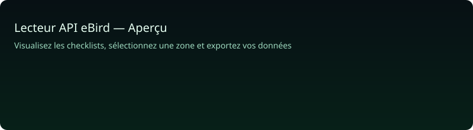

<div align="center">


# Lecteur API eBird

**Explorez les observations d'oiseaux en temps réel**

Une interface web libre et réactive qui utilise l'API eBird pour afficher des checklists, filtrer par espèce, exporter des données et explorer les zones sur une carte interactive.

[🌐 Démo en ligne](https://lecteur-api-ebird.vercel.app) · [💻 Code source](https://github.com/timeobonnin-prog/Lecteur-API-eBird) · [🔑 Obtenir une clé eBird](https://ebird.org/api/keygen) · [📄 Licence](https://github.com/timeobonnin-prog/Lecteur-API-eBird/blob/main/LICENSE)


     

---

## Présentation rapide
- Carte interactive (multi fonds)
- Recherche par espèce et par lieu (autocomplétion)
- Sélection de zone (découpage en tuiles pour respecter la limite 50 km)
- Cache client par tuile (réduction des appels API)
- Export CSV / JSON / TXT
- Adapté mobile (UI responsive)

## Capture & démo "en direct"
Une démo animée est incluse pour la landing page :



Pour remplacer par un vrai GIF :
- Ajoutez `public/demo.gif` (2–4s) — je peux générer un GIF si vous voulez — et remplacez l’image ci‑dessous par ``.
- Ou hébergez une courte vidéo et collez le lien ici.

Si vous voulez que je convertisse une capture vidéo en GIF et l'ajoute au dépôt, dites "Générer GIF".

## Installation rapide (aperçu frontend)
1. Cloner le dépôt :
```bash
git clone https://github.com/timeobonnin-prog/Lecteur-API-eBird.git
cd Lecteur-API-eBird
```
2. Prévisualiser la landing page :
```bash
python -m http.server 8000
# ouvrir http://localhost:8000
```
3. Pour tester l’application complète, déployer sur Vercel ou exécuter les fonctions dans `api/`.

## Configuration importante
- L’application frontend demande une clé eBird. Collez-la dans le champ prévu dans l’UI (stockée en `localStorage` sous `ebirdApiKey`).
- Variables serveur utiles : `HCAPTCHA_SECRET` (vérification captcha) et éventuellement `EBIRD_API_KEY` pour proxys.

## Fichiers clefs
- `index.html` — page de présentation / landing
- `public/` — UI, `public/script.js` contient la logique de sélection, cache et requêtes eBird
- `api/` — fonctions backend (ex: `verify-captcha.js`)

## Développement & contribution
Contributions bienvenues : ouvrez une issue, proposez une PR. Idées :
- Déplacer tout le traitement d’API côté serveur pour protéger la clé
- Réduire concurrence / backoff pour limiter les 429
- UI : ajouter diagnostics de cache (liste, purge) et améliorations d’accessibilité

## Licence
MIT — voir `LICENSE`.

---

Si vous voulez un README encore plus visuel (GIF intégré + badges dynamiques + tableau des commandes), dites "Ajouter GIF" ou "Rendre README plus technique" et je le fais.
